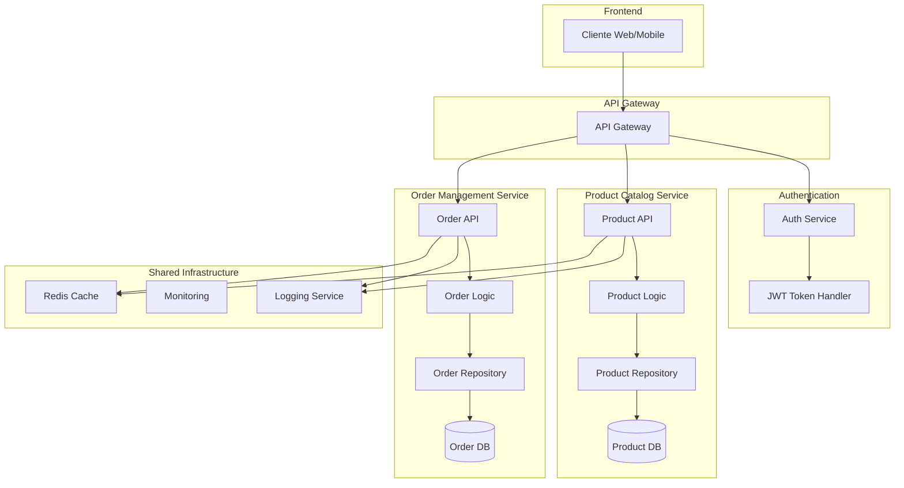

# Product Service

Servicio de gestión de productos implementado con Spring WebFlux y R2DBC, siguiendo una arquitectura hexagonal.

## Tecnologías Utilizadas

- Spring Boot 3.3.5
- Spring WebFlux
- R2DBC con MySQL
- Docker
- Gradle

## Estructura del Proyecto

```
src/
├── main/
│   ├── java/
│   │   └── com/ecommerce/product_service/
│   │       ├── application/
│   │       ├── domain/
│   │       └── infrastructure/
│   └── resources/
│       ├── application.yml
│       └── schema.sql
```

## Diagrama de Arquitectura


## Requisitos Previos

- Docker
- Docker Compose

## Configuración y Ejecución

### 1. Clonar el Repositorio

```bash
git clone https://github.com/alexjr17/ecommerce-product-service.git
cd product-service
```

### 2. Construcción y Ejecución con Docker

```bash
# Construir y ejecutar los contenedores
docker-compose up --build

# Detener los contenedores
docker-compose down
```

La aplicación estará disponible en:
- API: http://localhost:8081
- Base de datos MySQL: puerto 3307

### 3. Endpoints Disponibles

```
Productus
- GET `/api/products` - Listar todos los productos
- GET `/api/products/{id}` - Obtener un producto por ID
- POST `/api/products` - Crear un nuevo producto
- PUT `/api/products/{id}` - Actualizar un producto
- DELETE `/api/products/{id}` - Eliminar un producto

Ordenes
- GET `/api/orders` - Listar todos los productos
- GET `/api/orders/{id}` - Obtener un producto por ID
- POST `/api/orders` - Crear un nuevo producto
- PUT `/api/orders/{id}` - Actualizar un producto
- DELETE `/api/orders/{id}` - Eliminar un producto
```
### 4. Ejemplo de Petición POST

```bash
curl -X POST http://localhost:8081/api/products \
-H "Content-Type: application/json" \
-d '{
    "name": "Laptop",
    "description": "High performance laptop",
    "price": 999.99,
    "stock": 10
}'
```

## Arquitectura

El proyecto sigue una arquitectura hexagonal (ports and adapters) con tres capas principales:

1. **Domain**: Contiene la lógica de negocio y modelos
2. **Application**: Servicios de aplicación y casos de uso
3. **Infrastructure**: Adaptadores para la persistencia y API REST

## Pruebas

Para ejecutar las pruebas:

```bash
# Localmente con Gradle
./gradlew test

# Con Docker
docker-compose run --rm product-service ./gradlew test
```

## Configuración Docker

El proyecto incluye:

1. **Dockerfile**: Construye la imagen de la aplicación
2. **docker-compose.yml**: Orquesta la aplicación y la base de datos
3. **application-docker.yml**: Configuración específica para Docker

### Características del Dockerfile

- Build multi-etapa para optimizar el tamaño de la imagen
- Base en OpenJDK 17
- Configuración de puertos y variables de entorno
- Gradle como herramienta de construcción

### Docker Compose

Servicios configurados:
- MySQL 8.0
- Aplicación Spring Boot
- Volúmenes persistentes para la base de datos
- Healthchecks para garantizar el inicio correcto

## Mantenimiento

Para actualizar la aplicación:

1. Realizar cambios en el código
2. Reconstruir la imagen: `docker-compose up --build`
3. Los datos persistirán en el volumen de MySQL

## Troubleshooting

Si encuentras problemas:

1. Verificar logs: `docker-compose logs`
2. Reiniciar contenedores: `docker-compose restart`
3. Reconstruir desde cero: `docker-compose down -v && docker-compose up --build`
